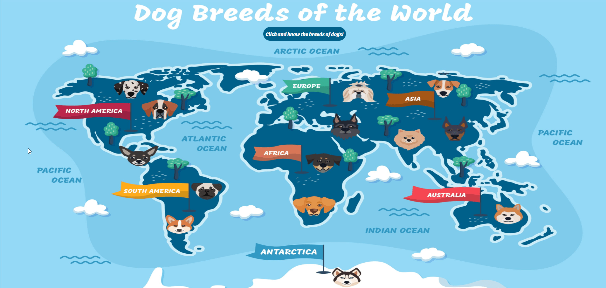
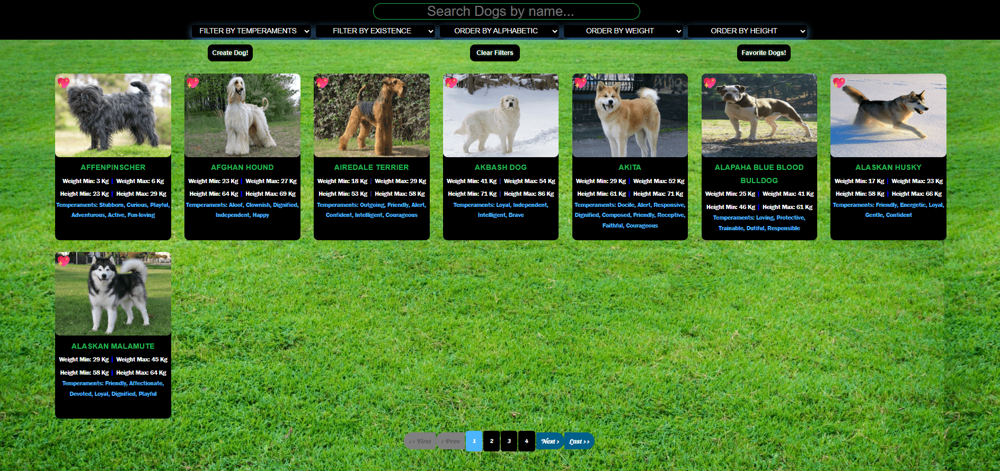
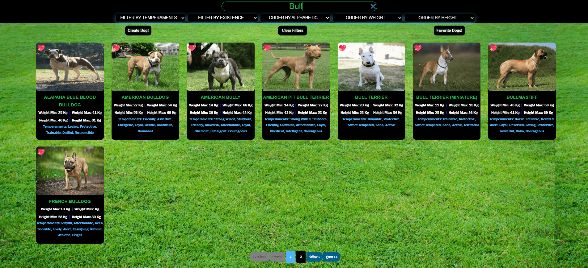
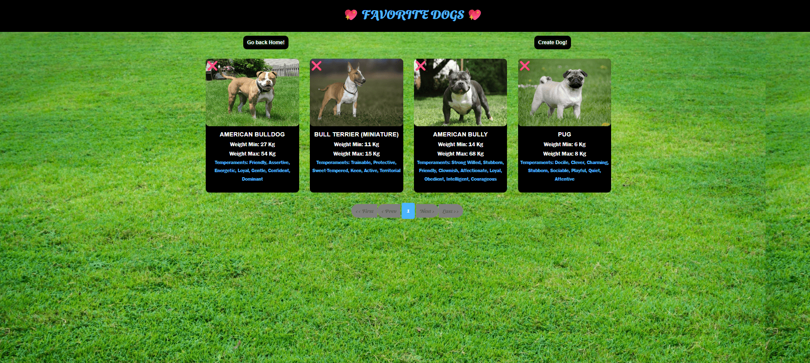
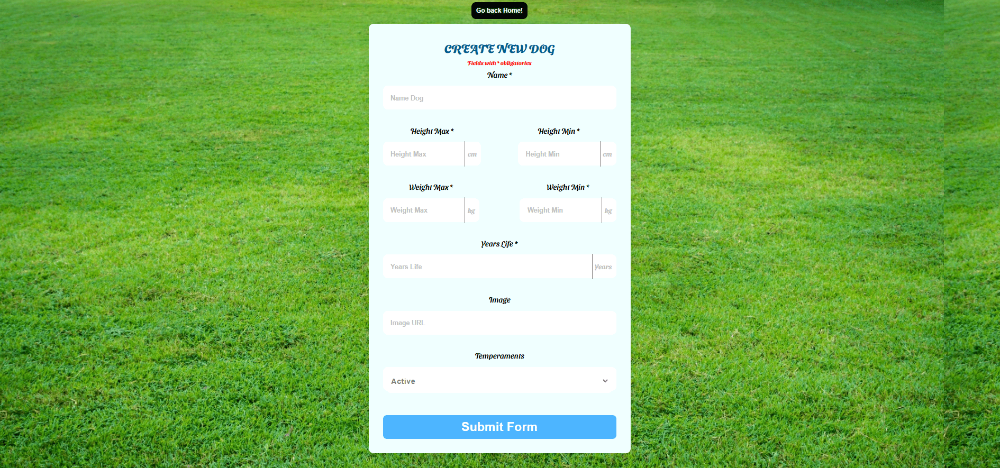
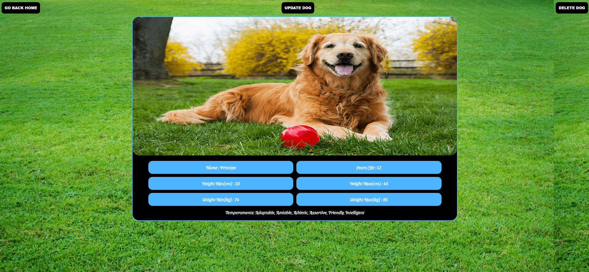

# 🐕 Dogs App - Frontend

Aplicação React para gerenciamento de informações sobre raças de cães com funcionalidades de favoritos, desenvolvida com React 18, Redux Toolkit e styled-components.

## � Índice

- [Sobre o Projeto](#sobre-o-projeto)
- [Tecnologias](#tecnologias)
- [Funcionalidades](#funcionalidades)
- [Arquitetura](#arquitetura)
- [Instalação](#instalação)
- [Configuração](#configuração)
- [Uso](#uso)
- [Estrutura do Projeto](#estrutura-do-projeto)
- [Componentes Principais](#componentes-principais)
- [Gerenciamento de Estado](#gerenciamento-de-estado)
- [Roteamento](#roteamento)
- [Scripts Disponíveis](#scripts-disponíveis)
- [Testes](#testes)
- [Deploy](#deploy)
- [Performance](#performance)
- [Contribuição](#contribuição)
- [Autor](#autor)

## 🎯 Sobre o Projeto

Dogs App é uma aplicação web moderna que permite aos usuários explorar, gerenciar e favoritar diferentes raças de cães. A aplicação consome dados de uma API externa (The Dog API) e permite criar, editar e deletar raças personalizadas, oferecendo uma experiência completa de gerenciamento de informações caninas.

### Principais Características

- **Interface Responsiva**: Design adaptável para desktop, tablet e mobile
- **Gerenciamento de Estado**: Redux Toolkit para estado global eficiente
- **Navegação SPA**: React Router para navegação fluida
- **Componentes Estilizados**: styled-components para CSS-in-JS
- **Alertas Interativos**: SweetAlert2 para feedback visual
- **Performance Otimizada**: Code splitting e lazy loading

## 📸 Screenshots

<div style="overflow-x: auto;">
    <table style="width: 100%;">
        <tr>
            <td style="width: 50%;"></td>
            <td style="width: 50%;"></td>
        </tr>
        <tr>
            <td style="width: 50%;"></td>
            <td style="width: 50%;"></td>
        </tr>
        <tr>
            <td style="width: 50%;"></td>
            <td style="width: 50%;"></td>
        </tr>
    </table>
</div>

---

## 🚀 Tecnologias

### Core Frontend

- **React** (^18.3.1) - Biblioteca para interfaces de usuário
- **React DOM** (^18.3.1) - Renderização DOM para React
- **React Router DOM** (^7.10.1) - Roteamento SPA

### Gerenciamento de Estado

- **Redux** (^5.0.1) - Gerenciamento de estado previsível
- **@reduxjs/toolkit** (^2.11.1) - Ferramentas modernas para Redux
- **react-redux** (^9.2.0) - Bindings React para Redux

### Estilização e UI

- **styled-components** (^6.1.19) - CSS-in-JS para componentes
- **react-icons** (^5.5.0) - Biblioteca de ícones
- **sweetalert2** (^11.26.4) - Alertas e modais elegantes

### Utilitários

- **axios** (^1.13.2) - Cliente HTTP para requisições
- **web-vitals** (^5.1.0) - Métricas de performance web

### Ferramentas de Desenvolvimento

- **@craco/craco** (^7.1.0) - Configuração customizada do webpack
- **cross-env** (^10.1.0) - Variáveis de ambiente cross-platform
- **eslint** (^8.57.1) - Linting de código
- **prettier** (^3.7.4) - Formatação de código
- **webpack-bundle-analyzer** (^4.10.2) - Análise de bundle

### Testes

- **@testing-library/react** (^13.4.0) - Utilitários de teste para React
- **@testing-library/jest-dom** (^5.17.0) - Matchers customizados para Jest
- **@testing-library/user-event** (^14.6.1) - Simulação de eventos de usuário
- **fast-check** (^4.4.0) - Testes baseados em propriedades

## ✨ Funcionalidades

### Exploração de Raças

- ✅ Visualizar todas as raças de cães disponíveis
- ✅ Buscar raças por nome
- ✅ Filtrar por temperamentos
- ✅ Ordenar por diferentes critérios (nome, peso, altura)
- ✅ Paginação para melhor performance

### Gerenciamento de Raças

- ✅ Visualizar detalhes completos de uma raça
- ✅ Criar nova raça personalizada
- ✅ Editar informações de raças existentes
- ✅ Deletar raças criadas pelo usuário

### Sistema de Favoritos

- ✅ Adicionar/remover raças dos favoritos
- ✅ Visualizar lista de raças favoritas
- ✅ Paginação específica para favoritos
- ✅ Persistência de favoritos no estado global

### Interface e UX

- ✅ Design responsivo para todos os dispositivos
- ✅ Loading states com animações
- ✅ Tratamento de erros com feedback visual
- ✅ Navegação intuitiva com breadcrumbs
- ✅ Página 404 personalizada

## 🏗️ Arquitetura

```
dogs-app-frontend/
├── public/
│   ├── index.html            # Template HTML principal
│   ├── manifest.json         # Configuração PWA
│   ├── robots.txt           # Configuração SEO
│   └── dog.png              # Favicon
├── src/
│   ├── components/          # Componentes React
│   │   ├── Welcome/         # Página de boas-vindas
│   │   ├── Home/            # Página principal
│   │   ├── DogDetails/      # Detalhes da raça
│   │   ├── CreateDog/       # Criação de raça
│   │   ├── UpdateDog/       # Edição de raça
│   │   ├── DogsFavorites/   # Lista de favoritos
│   │   ├── DogCard/         # Card de raça
│   │   ├── NavBar/          # Barra de navegação
│   │   ├── Paginated/       # Paginação principal
│   │   ├── PaginatedFavorites/ # Paginação favoritos
│   │   ├── Loader/          # Componente de loading
│   │   └── NotFound/        # Página 404
│   ├── redux/
│   │   ├── actions/         # Actions do Redux
│   │   ├── reducer/         # Reducers do Redux
│   │   └── store/           # Configuração da store
│   ├── images/              # Assets de imagem
│   ├── App.js               # Componente raiz
│   ├── App.css              # Estilos globais
│   ├── index.js             # Entry point
│   ├── index.css            # Estilos base
│   ├── reportWebVitals.js   # Métricas de performance
│   └── setupTests.js        # Configuração de testes
├── scripts/
│   ├── build-prod.js        # Script de build otimizado
│   ├── build-stats.js       # Análise de build
│   └── dev-server.js        # Servidor de desenvolvimento
├── docs/                    # Documentação adicional
├── tests/                   # Testes automatizados
├── craco.config.js          # Configuração CRACO
├── package.json
└── .env.example             # Exemplo de variáveis de ambiente
```

## 📦 Instalação

### Pré-requisitos

- Node.js >= 18.0.0
- npm >= 8.0.0 ou yarn >= 1.22.0
- Git

### Passos

1. Clone o repositório:

```bash
git clone <repository-url>
cd dogs-app-frontend
```

2. Instale as dependências:

```bash
npm install
# ou
yarn install
```

3. Configure as variáveis de ambiente:

```bash
cp .env.example .env
```

4. Edite o arquivo `.env` com suas configurações:

```env
REACT_APP_API_URL=http://localhost:3001/api
REACT_APP_DOG_API_KEY=your_dog_api_key_here
GENERATE_SOURCEMAP=true
```

5. Inicie o servidor de desenvolvimento:

```bash
npm run dev
# ou
yarn dev
```

A aplicação estará disponível em `http://localhost:3000`

## ⚙️ Configuração

### Variáveis de Ambiente

```env
# API Configuration
REACT_APP_API_URL=http://localhost:3001/api
REACT_APP_DOG_API_KEY=your_api_key_here

# Development Configuration
GENERATE_SOURCEMAP=true
REACT_APP_ENV=development

# Build Configuration
BUILD_PATH=build
PUBLIC_URL=/
```

### Configuração CRACO

O projeto utiliza CRACO para customizar a configuração do webpack:

```javascript
// craco.config.js
module.exports = {
  webpack: {
    configure: (webpackConfig) => {
      webpackConfig.resolve.fallback = {
        path: require.resolve("path-browserify"),
        fs: false,
        crypto: false,
        stream: false,
        // ... outras configurações
      };
      return webpackConfig;
    },
  },
};
```

## 🎮 Uso

### Desenvolvimento

```bash
npm run dev          # Inicia servidor de desenvolvimento
npm run build:dev    # Build com source maps
npm run test:watch   # Testes em modo watch
```

### Produção

```bash
npm run build        # Build otimizado para produção
npm start           # Serve arquivos estáticos
```

### Análise e Debugging

```bash
npm run build:analyze    # Analisa tamanho do bundle
npm run test:coverage    # Testes com coverage
npm run lint            # Executa ESLint
npm run format          # Formata código com Prettier
```

## 🧩 Componentes Principais

### Welcome

Página inicial com apresentação da aplicação e navegação para a área principal.

### Home

Interface principal com:

- Lista de todas as raças
- Filtros por temperamento
- Busca por nome
- Ordenação customizável
- Paginação

### DogDetails

Visualização detalhada de uma raça específica com:

- Informações completas (peso, altura, temperamentos)
- Imagem da raça
- Botões de ação (editar, favoritar)

### CreateDog / UpdateDog

Formulários para criação e edição de raças com:

- Validação de campos
- Upload de imagem
- Seleção de temperamentos
- Feedback visual

### DogsFavorites

Lista dedicada às raças favoritadas com:

- Paginação específica
- Remoção de favoritos
- Interface otimizada

## 🔄 Gerenciamento de Estado

### Redux Store

```javascript
// Estrutura do estado global
{
  dogs: [],              // Lista de todas as raças
  dogDetails: {},        // Detalhes da raça selecionada
  temperaments: [],      // Lista de temperamentos
  favorites: [],         // Raças favoritas
  filters: {
    name: '',
    temperament: '',
    sort: 'name_asc'
  },
  loading: false,
  error: null
}
```

### Actions Principais

- `GET_DOGS` - Buscar todas as raças
- `GET_DOG_DETAILS` - Buscar detalhes de uma raça
- `CREATE_DOG` - Criar nova raça
- `UPDATE_DOG` - Atualizar raça existente
- `DELETE_DOG` - Deletar raça
- `ADD_TO_FAVORITES` - Adicionar aos favoritos
- `REMOVE_FROM_FAVORITES` - Remover dos favoritos
- `FILTER_DOGS` - Aplicar filtros
- `SORT_DOGS` - Ordenar lista

## 🛣️ Roteamento

```javascript
// Estrutura de rotas
/                    # Welcome - Página inicial
/home               # Home - Lista principal
/dogDetails/:id     # DogDetails - Detalhes da raça
/dogCreate          # CreateDog - Criar nova raça
/dogUpdate/:id      # UpdateDog - Editar raça
/dogsFavorites      # DogsFavorites - Lista de favoritos
/*                  # NotFound - Página 404
```

## 📜 Scripts Disponíveis

### Desenvolvimento

```bash
npm run dev              # Servidor de desenvolvimento
npm run build:dev        # Build com debugging
npm run test:watch       # Testes em modo watch
```

### Produção

```bash
npm run build           # Build otimizado
npm start              # Servidor de produção
npm run clean          # Limpar build anterior
```

### Qualidade

```bash
npm run lint           # ESLint com correções
npm run format         # Prettier formatting
npm run test          # Executar todos os testes
npm run test:coverage # Testes com coverage
```

### Análise

```bash
npm run build:analyze  # Análise do bundle
npm run postbuild     # Estatísticas pós-build
```

## 🧪 Testes

### Estrutura de Testes

```
tests/
├── components/
│   ├── Welcome.test.js
│   ├── Home.test.js
│   ├── DogDetails.test.js
│   └── ...
├── redux/
│   ├── actions.test.js
│   ├── reducers.test.js
│   └── store.test.js
├── integration/
│   └── userFlows.test.js
└── property-based/
    ├── build.property.test.js
    ├── bundle-size.property.test.js
    └── functional-preservation.property.test.js
```

### Tipos de Testes

- **Unit Tests**: Componentes individuais
- **Integration Tests**: Fluxos de usuário completos
- **Property-Based Tests**: Validação de propriedades do sistema
- **Performance Tests**: Métricas de bundle e carregamento

### Executar Testes

```bash
npm test                    # Todos os testes
npm run test:watch         # Modo watch
npm run test:coverage      # Com coverage report
```

## 🚀 Deploy

### Vercel (Recomendado)

1. Conecte seu repositório ao Vercel
2. Configure as variáveis de ambiente:
   - `REACT_APP_API_URL`
   - `REACT_APP_DOG_API_KEY`
3. Deploy automático a cada push

### Netlify

1. Build command: `npm run build`
2. Publish directory: `build`
3. Configure variáveis de ambiente no dashboard

### Manual

```bash
npm run build
# Upload da pasta 'build' para seu servidor
```

## ⚡ Performance

### Otimizações Implementadas

- **Code Splitting**: Divisão automática de código
- **Lazy Loading**: Carregamento sob demanda
- **Bundle Analysis**: Monitoramento de tamanho
- **Image Optimization**: Otimização de imagens
- **Caching**: Cache de requisições HTTP

### Métricas Alvo

- **First Contentful Paint**: < 1.5s
- **Largest Contentful Paint**: < 2.5s
- **Cumulative Layout Shift**: < 0.1
- **Bundle Size**: < 500KB gzipped

### Monitoramento

```bash
npm run build:analyze      # Análise detalhada do bundle
npm run test:performance   # Testes de performance
```

## 📚 Documentação Adicional

- [Scripts de Desenvolvimento](docs/README-SCRIPTS.md)
- [Otimizações de Performance](docs/PERFORMANCE-OPTIMIZATION.md)
- [Métricas Baseline](docs/baseline-metrics.md)
- [Relatório de Validação](docs/final-validation-report.md)

## 🤝 Contribuição

### Fluxo de Desenvolvimento

1. Fork o projeto
2. Crie uma branch para sua feature (`git checkout -b feature/nova-funcionalidade`)
3. Commit suas mudanças (`git commit -m 'feat: adiciona nova funcionalidade'`)
4. Push para a branch (`git push origin feature/nova-funcionalidade`)
5. Abra um Pull Request

### Padrões de Código

- **ESLint**: Configuração react-app
- **Prettier**: Formatação automática
- **Conventional Commits**: Padrão de commits
- **Component Structure**: Componentes funcionais com hooks

### Antes de Contribuir

```bash
npm run lint           # Verificar linting
npm run format         # Formatar código
npm test              # Executar testes
npm run build         # Verificar build
```

## 🔒 Segurança

### Medidas Implementadas

- Sanitização de inputs
- Validação de dados no frontend
- Headers de segurança configurados
- Dependências atualizadas regularmente
- Análise de vulnerabilidades automática

## 🌐 Suporte a Navegadores

### Produção

- Chrome (últimas 2 versões)
- Firefox (últimas 2 versões)
- Safari (últimas 2 versões)
- Edge (últimas 2 versões)

### Desenvolvimento

- Chrome (última versão)
- Firefox (última versão)
- Safari (última versão)

## 📄 Licença

Este projeto não possui licença e para uso público.

## 👤 Autor

**Seu Nome**

- GitHub: [@ENDERSON-MARIN](https://github.com/ENDERSON-MARIN)
- LinkedIn: [Enderson Millan](https://linkedin.com/in/enderson-millan)
- Email: millanendersondev@gmail.com

---

⭐ Se este projeto foi útil para você, considere dar uma estrela!

🐕 Feito com ❤️ para amantes de cães
